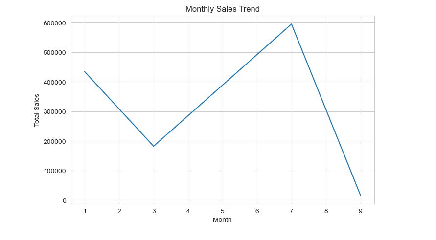
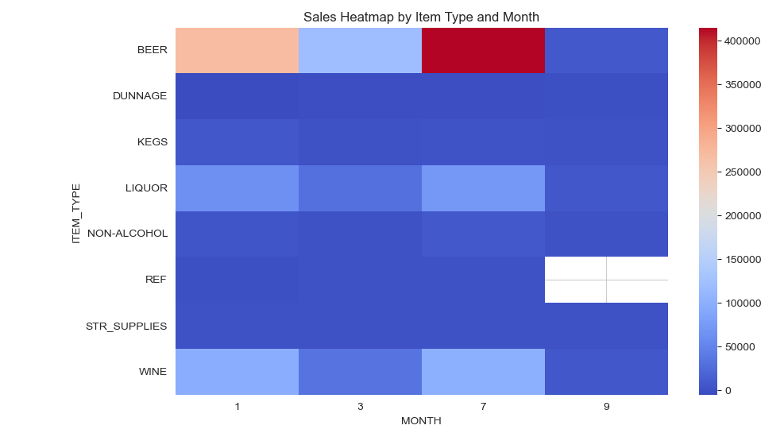
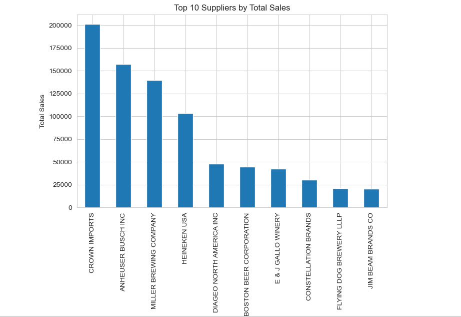

# Retail Sales & Seasonal Trend Analysis

## Project Overview
This project analyzes retail and warehouse sales data to uncover seasonal demand patterns, evaluate product and supplier performance, and identify key sales trends.  

Using Python-based exploratory data analysis (EDA), the project transforms raw sales data into meaningful insights that can help businesses improve inventory planning, supplier management, and sales strategy.

---

## Business Problem
Retail businesses generate large volumes of transactional data, making it difficult to quickly identify meaningful sales patterns.  

Key business questions addressed in this project:

- How do retail sales vary across different months?
- Are there clear seasonal demand patterns?
- Which suppliers contribute the most to overall sales?
- How do retail and warehouse sales compare?

By analyzing historical sales data, businesses can better understand purchasing behavior and prepare for seasonal demand fluctuations.

---

## Dataset
The dataset contains retail and warehouse sales records across multiple suppliers and product categories.

Key fields include:

- **Year / Month** – Time of transaction  
- **Supplier** – Product supplier  
- **Item Description** – Product name  
- **Item Type** – Product category  
- **Retail Sales** – Sales through retail channels  
- **Warehouse Sales** – Distribution center sales  
- **Total Sales** – Combined sales value

---

## Tools & Technologies
- **Python**
- **Pandas** – Data manipulation and analysis
- **NumPy** – Numerical operations
- **Matplotlib** – Data visualization
- **Seaborn** – Statistical visualization
- **Jupyter Notebook** – Analysis environment

---

## Key Analysis Performed
- Data cleaning and preprocessing
- Exploratory Data Analysis (EDA)
- Monthly sales trend analysis
- Seasonal demand pattern identification
- Supplier performance comparison
- Retail vs Warehouse sales comparison

---

## Key Insights
- Sales show noticeable **seasonal fluctuations across different months**.
- A small number of suppliers contribute a **significant portion of total sales**.
- Retail sales demonstrate **clear monthly demand patterns**.
- Seasonal analysis highlights **peak demand periods that businesses can prepare for**.

---

## Visualizations

### Monthly Sales Trend


### Sales Heatmap


### Supplier Sales Analysis


---

## Project Structure

```
retail-sales-seasonal-trend-analysis
│
├── data
│   └── Retail & Warehouse Sales_Cleaned.csv
│
├── notebooks
│   └── retail_sales_analysis.ipynb
│
├── scripts
│   └── retail_sales_analysis.py
│
├── visuals
│   ├── monthly_sales_trend.png
│   ├── seasonal_heatmap.png
│   └── supplier_sales.png
│
├── README.md
└── requirements.txt
```

---

## How to Run the Project

1. Clone the repository
git clone https://github.com/hrishikeshmurudkar-data/retail-sales-seasonal-trend-analysis.git

2. Install required libraries
pip install -r requirements.txt

3. Run the Jupyter Notebook
Open notebooks/retail_sales_analysis.ipynb


## Author
**Hrishikesh Murudkar**  
Aspiring Data Analyst
